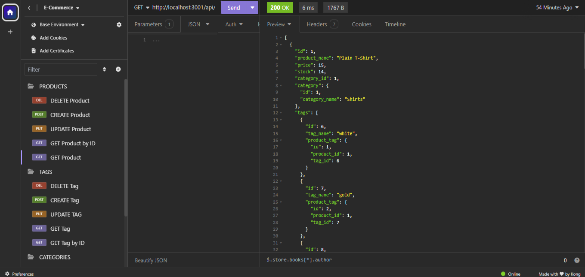

# E-commerce Backend 

A robust backend API for e-commerce platforms built with Express.js and Sequelize ORM. This API provides comprehensive data management for products, categories, and tags, supporting the core functionality needed for modern e-commerce operations.

## Features

- RESTful API endpoints for:
    - Products
    - Categories
    - Tags
    - Product Tags
- Full CRUD operations
- Relational data modeling using Sequelize
- MySQL database integration
- Environmental variable support for secure configuration

## Technical Stack

- Node.js
- Express.js
- MySQL2
- Sequelize ORM
- dotenv for environment variables
- Nodemon for development

## Instructions
### Installation

1. Clone the repository
2. Install dependencies:
```
npm install
```
3. Create a `.env` file in the root directory with the following variables:
```
DB_NAME='ecommerce_db'
DB_USER='your_username'
DB_PW='your_password'
```

### Database Setup

1. Login to MySQL:
```
mysql -u root -p
```
2. Create the database:
```
source db/schema.sql
```
3. Exit MySQL
4. Seed the database:
```
npm run seed
```

### Usage
1. Start the server:
```
npm start
```
2. Access the API at `http://localhost:3001/api/`

### Testing
API endpoints can be tested using Insomnia or similar API testing tools.

### Screenshots



### Walkthrough

https://drive.google.com/file/d/1ob_jxL9Lp3YEpuORB3zHVoik-mQPWcCX/view?usp=sharing

https://drive.google.com/file/d/17ZQipA1JSky_gWUHMGbmSgkGKTGNqzLO/view?usp=sharing

https://drive.google.com/file/d/1lAQPAJ1gmnXUFdT7a0xHxH3vjerSPOKN/view?usp=sharing

https://drive.google.com/file/d/1ai4zwIkKMkUVmNlcsyFg5OehGmVq3CLQ/view?usp=sharing

## Available Endpoints

- Categories: `/api/categories`
    - GET all categories
    - GET category by ID
    - POST new category
    - PUT update category
    - DELETE category

- Products: `/api/products`
    - GET all products
    - GET product  by ID
    - POST new product
    - PUT update product
    - DELETE product

- Tags: `/api/tags`

    - GET all tags
    - GET tag by ID
    - POST new tag
    - PUT update tag
    - DELETE tag

## Models

- **Category**: Store product categories
- **Product**: Store product information
- **Tag**: Store product tags
- **ProductTag**: Junction table for product-tag associations

## Relationships

- Products belong to Category
- Categories have many Products
- Products belong to many Tags (through ProductTag)
- Tags belong to many Products (through ProductTag)

## License
ISC